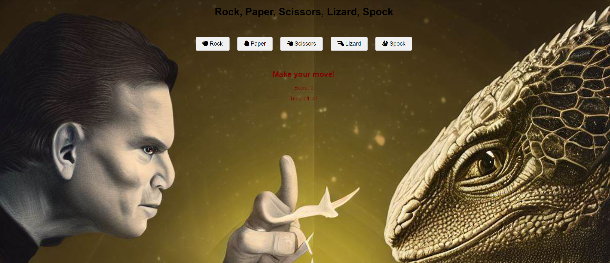

# Rock Paper Scissors Lizard Spock Game

This is a JavaScript implementation of the popular game "Rock Paper Scissors Lizard Spock," as featured in the TV show "The Big Bang Theory." The game expands on the classic Rock Paper Scissors game by adding two additional options: Lizard and Spock.

## How to Play

1. Clone or download this repository to your local machine.
2. Open the `index.html` file in your web browser.
3. Select your choice (Rock, Paper, Scissors, Lizard, or Spock) by clicking on the corresponding button.
4. The computer will randomly choose its option.
5. The result of the game will be displayed on the screen, indicating whether you won, lost, or tied with the computer.

## Game Rules

The game follows the following rules:

- Rock crushes Scissors
- Rock crushes Lizard
- Paper covers Rock
- Paper disproves Spock
- Scissors cuts Paper
- Scissors decapitates Lizard
- Lizard eats Paper
- Lizard poisons Spock
- Spock vaporizes Rock
- Spock smashes Scissors

## Technologies Used

- HTML: The structure and presentation of the game interface.
- CSS: Styling and layout of the game elements.
- JavaScript: The logic and functionality of the game.

## File Structure

The repository consists of the following files:

- `index.html`: The main HTML file that renders the game interface.
- `styles.css`: The CSS file that defines the styles and layout of the game elements.
- `script.js`: The JavaScript file that implements the game logic.

## Game Screenshots

## Acknowledgements

This game was has drawn inspiration from the "Rock Paper Scissors Lizard Spock" game as seen on "The Big Bang Theory" TV show.

---

Have fun playing the Rock Paper Scissors Lizard Spock game! 🤘🖐✌️🦎🖖
